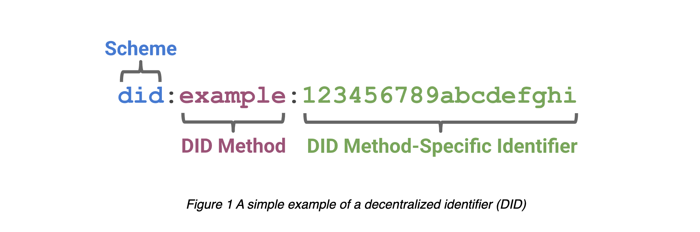

# DID Limitations

### **Introduction**
Since the evolution of the internet, there has been a growing need for 
entities- people, animals, things, places, organizations, concepts, ideas or anything that can be represented on the internet to be identified uniquely on the internet and thus a continuous evolution 
of identity Models from Silo Identity Model which was easy to use but largely 
limited due to the lack of persistence and reusability, then we moved to the IDP Federated Identity Model which basically has a single point of failure and lacks persistence, so in search for yet a better option, Self-Sovereign Identity(SSI) Model emerged, which proposes fixes to the challenges of the previous models.

### **What is Self-Sovereign Identity(SSI)**
Self-Sovereign Identity(SSI) is an identity model that makes it possible for an entity to establish a pairwise connection with another entity in a purely decentralized manner. The model comprises Decentralized Identifiers(DIDs) as the base layer, Decentralized Key Management Systems(DKMS), DID Authentication(DID Auth) and Verifiable Credentials(VC). We would be looking closely at DID.
### **What is Decntralized Identifier (DID)**

A [Decntralized Identifier (DID)](https://www.w3.org/TR/did-core/#dfn-decentralized-identifiers)refers to a pseudo-anonymous way of identifying an entity in a cryptographically verifiable way. Technically we can say a DID is a URI because it hybrids the URL which locates resources on a network and a URN which is a persistent name for a resource on the network as stated by [Drummond Reed](https://ssimeetup.org/decentralized-identifiers-dids-fundamentals-identitybook-info-drummond-reed-markus-sabadello-webinar-46/) and this is what it looks like 

 

There are four core properties of a DID

a DID is:-
- **A Persistent or Permanent Identifier**: It never needs to change with the course of time
- **A Resolvable Identifier**: Anyone can look it up to get its metadata
- **A cryptographically-verifiable Identifier**: The owner can prove control using cryptography
- **A decentralized Identifier**: No centralized registration authority is needed.

### **How does a DID work?**

With a DID, a verifier would be able to resolve it into a [DID Document](https://www.w3.org/TR/did-core/#dfn-did-documents) which contains the minimum amount of information needed to bootstrap other necessary information needed to interact or connect with the [DID Subject](https://www.w3.org/TR/did-core/#did-subject) such as one or more public keys or other verification methods used for authenticating the DID Subject during an interaction, under the control of the DID Controller, one or more services endpoints that specify how to interact with the DID Subject and some optional elements like timestamps for audit history, digital signature for integrity, information related to delegation and authorization. A DID has three parts, the DID [scheme](https://www.w3.org/TR/did-core/#dfn-did-schemes) identifier, the identifier for the DID [method](https://www.w3.org/TR/did-core/#dfn-did-methods), and the DID method-specific-identifier which is described by the DID method eg for Ethereum based DIDs, it could be the smart contract address of the DID or the hash of the key as in Bitcoin reference

### **What can we do with DIDs**
 DIDs can be used for a platera of things and they include

 - **Enterprise Identifiers**
 - - At the enterprise level, DIDs would ensure 1) A competitive marketplace, 2) Low management overhead for the government 3) Self-management of Identifiers and cryptographic materials. Imagine a government that wants to ensure that the supply chain that feeds electronic products into her borders is secure, so she authorizes a new way of submitting digital documentation to her Customs office, that all documentation is provided as machine-readable digitally signed data with proof of provenance from supply chain partners whose identities are also known to a great degree of certainty. Documents that are signed with digital proofs are provided at every stage from manufacturing, to packaging down to shipping. This document is submitted to Customs on arrival where all the digital signatures are verified and checked to verify and ensure that the products arrived at the borders of the country as they left the manufacturing facility, and have not been tampered with.

---

 - Life-Long Credential
 - - If we want to make a comparison between [Verifiable Educational Credentials](https://www.w3.org/TR/did-use-cases/#bib-vc-data-model) and the traditional ones, it is easy to see that the verifiable Educational Credentials offer many benefits, which include recipients being able to store and share their credentials with third parties, who in turn are able to independently not just verify the credential but also authenticate the identity of the recipient without necessarily contacting the issuer and without dependence of the usual countries treaty-based bureaucratic process for international verification of credentials. This makes it possible for a recipient to own his/her credentials for a lifetime that can be used without borders, even when to issuing organization goes out of business.
  <!--  
  Prescriptions
  ---
  Digital Executor
  ---
  Bob rents a car  
  -->

 - ---
 - Portable Secure Communication
 - - Designing a secure communication system that would be supported at a global scale on the Web has always come with a unique set of tradeoffs that end up negatively impacting the end-user. For instance, the current PKI systems tightly control who manages and controls the cryptographic keys associated with the set of digital certificates. This implies that modern cryptography is largely unusable by the average user, so they would have to borrow or rent identifiers from other systems like [DNS](https://en.wikipedia.org/wiki/Domain_Name_System), [X.509](https://en.wikipedia.org/wiki/X.509), and [social networks](https://en.wikipedia.org/wiki/Social_network) to use their identifiers like domain names, email addresses or user names. Being unable to directly control their identifiers, users are forced to choose between traditional messaging services to safely carry out communication for whatever needs they have since they can not directly utilize cryptography security in their communication. In a traditional secure messaging platform, the security is the complete property of the platform, so if a user changes a platform, be it temporarily or permanently, they have to leave behind all their interactions and put up with a new set of verification credentials and terms of service which are defined by the new platform.  
 - DIDs take control and security out of the hands of the service providers or essentially the context owners and put them in the hands of the DID controller who has the liberty to choose which context to communicate in and when to do so. This makes security decentralized and portable making it possible for users to switch communication contexts without losing security guarantees and providing resilience in internet communication. Present secure communication channels have the following limitations:-
 - 1. Relies on commonly used identifiers which are not directly under the control of the user
 - 2. Interactions are facilitated by centralized intermediaries
 - 3. It requires that at least one of the parties involved in the communication have a highly available web server
 - 4. The security architecture of the platforms is siloed and not interoperable, tied to a single domain.
 - To address the challenges of traditional secure communication channels as seen above, DID intervenes in the following ways
 - 1. By enabling a style of communication that is truly peer-to-peer and message-based. Message-based systems decouple the "message producer" and "message consumer" relationship thereby creating an abstraction that put the two on an equal footing, allowing many different devices with different requirements to interface in a flexible and technology-neutral way.
 - 2. By allowing people to simultaneously use the same identifier for both traditional communication and newer transactions that require a higher level of cryptographic security and also freely switch contexts without losing any security guarantees because DIDs are not rented or borrowed from centralized providers but are rather under the direct control of the user.
 - ---

### **Challenges with DIDs Use cases**
- The Customs and the downstream customers of the products as mentioned in the Enterprise Identifier above are required to use the same documentation and digital signature to verify the product, which could be problematic. Governments usually create ad-hoc solutions for their imports. This would make securing the global supply chain difficult because each government have its own way of identifying corporations that downstream customers integrate with and securing its supply chain. Now the challenge would be if you are a global company, it means integrating with many different supply chain systems with different capabilities. That means securing the supply chain with the downstream customers would depend on country-specific corporate identification and Public Key Infrastructure (PKI) solutions which would, in summary, drive up the cost of doing business across borders for global companies.

---
- Even with such great promise from the Verifiable Educational Credential use case, there are a couple of challenges that befall the approach:-
- 1. There is a problem with this, however, especially if the traditional public-private key pair identifier is used because of [rotating keys](https://developer.okta.com/docs/concepts/key-rotation/), and especially if the identifier in the credential is simply a public key and the private key is used for authentication.
- 2. Because the credential has been signed with the public key, it is virtually impossible to update the signing key of the credential. If need be, the recipient must have to contact the issuer to request a re-issuing with a different identifier and if the issuer is unavailable or not willing to re-issue the credential, the recipient is unable to update the cryptographic material.
- 3. If the key rotation of the credentials depends on a centralized key registry or authority, then that becomes a single point of failure and thus may not be such an improvement, especially for credentials held longer.
- 4. If the technology used to encrypt the credential becomes outdated, it will not update it and the recipient would have to contact the issuer for re-issuance.

If the credential is expected to last a lifetime, it is especially problematic when considering key rotation because it should be anticipated that an individual will change their key management system or strategy many times over the course of their lifetime.

---

DID secure communication comes with some experience challenges though, they include:-
- 1. Management of different communication contexts and switching between them.
- 2. Automation of connection management eg key rotation, updating service endpoints, routing via agents
  
  Users should be able to interact with, modify and audit processes as needed. Because users would likely interact with secure messaging protocols via a number of different interfaces and devices and for a variety of different purposes though the logic and the experience should be coherent and consistent across different platforms.
### **What does the specifications of DID allow us to do?**
<!--
As we have established, DIDs do not exist on a single registry. DIDs are implemented using [Methods](https://www.w3.org/TR/did-core/#methods) which refers to the approach or implementation of the DID. Different DID methods have different implementations, some are implemented on a Decentralized Ledge Technology (DLT) eg [btcr](https://w3c-ccg.github.io/didm-btcr/), [ethr](https://github.com/decentralized-identity/ethr-did-resolver/blob/master/doc/did-method-spec.md), [3](https://developers.ceramic.network/docs/advanced/standards/accounts/3id-did/) or stored on a specialized site eg GitHub, or on ephemeral DIDs with lighter requirements eg the ones used on IoT devices 
-->

